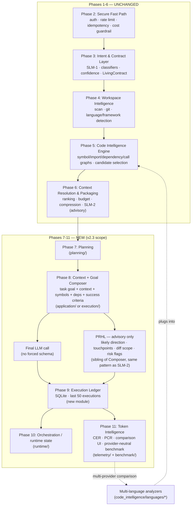

# ARCF v2.3 Architecture Review

**Status:** Review only — no implementation in this document, per request.
**Baseline:** ARCF v2.2, Phases 1–6 (commit `2e12359`), plus the benchmark harness added on top of it this session.
**Author:** Architecture review conducted against the actual codebase (not the original planning docs) — every claim below is traceable to a specific file.

---

## 0. Executive Summary

The v2.3 brief reads like a pivot: *"reposition ARCF from a prompt-constraining framework into a deterministic repository-intelligence and context-optimization layer."* Having read every relevant file in `arcf/src/`, the more accurate framing is:

> **v2.3 is not a pivot. It is Phases 7–11 of the plan v2.2 already wrote for itself, arriving in a different order than originally numbered, plus one new observability sub-module (PRHL).**

Evidence: `arcf/src/domain/execution_context.py`, `versioning.py`, `context_package.py`, `context_resolution.py`, and `interfaces/api/schemas.py` all contain forward references to phases that don't exist as code yet:

| Referenced phase | What it says | Where |
|---|---|---|
| Phase 7 | "planning" | `domain/context_package.py:8` |
| Phase 8 | "prompt compilation", produces `Artifact` ("LLM Output") | `domain/artifact.py:1`, `domain/context_package.py:8` |
| Phase 9 | **Execution Ledger** | `domain/execution_context.py:7`, `domain/versioning.py:8` |
| Phase 10 | LangGraph state / checkpoint, wraps `Contract` + `ExecutionContext` | `domain/execution_context.py:8`, `domain/versioning.py:8` |
| Phase 11 | Token Intelligence Engine — CER, PCR, **"the benchmark harness"** | `domain/context_resolution.py:92`, `domain/context_package.py:50`, `interfaces/api/schemas.py:7` |

So: "Execution Ledger" (v2.3 ask #5) is literally Phase 9 in the existing docstrings. "Comparison UI" and "benchmark neutrality" (asks #3–4) are literally Phase 11, and the schemas module already says the benchmark harness would consume `ExecutionContext.request_id`/`trace_id`/budget for exactly this. What v2.3 actually adds *new* relative to that existing plan is:

1. A concrete architectural home for those phases inside the existing stub packages (`application/`, `execution/`, `governance/`, `planning/`, `runtime/`, `telemetry/`, `validation/` — all currently empty, scaffolded in Phase 1 per their own docstrings, e.g. `arcf/src/planning/__init__.py`).
2. **PRHL** (Predictive Response Hinting Layer) — genuinely new, not previously referenced anywhere.
3. An explicit design constraint that Phase 8 (prompt compilation) must not impose a rigid output schema — worth stating explicitly even though, as §2.3 shows, nothing in the current codebase actually does this yet.
4. Multi-language — not previously scoped, but §2.2 shows the extension point already exists and needs zero structural change.

**Net assessment:** low structural risk. Phases 1–6 need no changes. Phases 7–11 are net-new code in already-reserved locations. The main engineering work is designing four new subsystems (Context+Goal Composer w/ PRHL, multi-language analyzers, Execution Ledger, provider-neutral benchmark harness) that compose with, rather than modify, the existing pipeline.

---

## 1. Current State Assessment

### 1.1 What's built (Phases 1–6) — verified file-by-file

| Phase | Responsibility | Key files | Status |
|---|---|---|---|
| 1 | Domain models, shared config/errors/clock | `domain/*.py`, `shared/*.py` | Complete |
| 2 | Secure Fast Path: auth, rate limit, idempotency, cost guardrail, tracing, raw `/api/v1/execute` | `infrastructure/{auth,rate_limit,idempotency,cost,tracing}.py`, `interfaces/api/routes/execute.py` | Complete, generic (model-agnostic via `LiteLLMClient`) |
| 3 | Intent & Contract Layer: SLM-1 intent extraction, deterministic classifier corroboration, confidence scoring, clarification planning, `Contract`/`LivingContract` versioning | `contracts/*.py`, `domain/{contract,intent,versioning}.py` | Complete |
| 4 | Workspace Intelligence: git/language/framework detection, bounded file scan, permissions | `workspace/*.py` | Complete |
| 5 | Code Intelligence Engine: symbol index, import/dependency/inheritance/call graphs, candidate selection, context resolution | `code_intelligence/*.py` | Complete, **Python-only today** (one registered analyzer) |
| 6 | Context Resolution/Packaging: relevance ranking, token-budget selection, symbol-range compression, SLM-2 (advisory understanding notes) | `context/*.py` | Complete |
| 7–11 | Planning / Prompt Compilation / Execution Ledger / Orchestration / Token Intelligence | `application/`, `execution/`, `governance/`, `planning/`, `runtime/`, `telemetry/`, `validation/` (all one-line stub `__init__.py`s) | **Not built** |

Also built this session, outside `arcf/src` entirely: `benchmark/` — a standalone app that drives the Phase 1–6 pipeline unmodified to compare Direct LLM vs ARCF (remote and local SLM-1), including a provider-agnostic `LiteLLMClient` wrapper (already supports OpenAI/Gemini/Groq/Ollama/Anthropic — anything litellm supports) and a statistical validation suite. This is directly relevant to v2.3 ask #4 (benchmark neutrality) — see §3.5.

### 1.2 Multi-language: the extension point already exists

`code_intelligence/language_analyzer.py` defines `LanguageAnalyzer` as a `Protocol`:

```python
class LanguageAnalyzer(Protocol):
    @property
    def language(self) -> str: ...
    def handles(self, file_path: str) -> bool: ...
    def analyze_file(self, file_path: str, source_text: str, workspace_files: frozenset[str]) -> FileAnalysis: ...
```

`code_intelligence/registry.py`'s `LanguageRegistry` dispatches purely on `handles()`; nothing else in `code_intelligence/` imports tree-sitter or knows any language's syntax — everything downstream (`SymbolIndex`, `ImportGraph`, `DependencyGraph`, `InheritanceGraph`, `CallGraph`, `CandidateFileSelector`) operates only on the language-independent IR (`Symbol`, `CallReference`, `ImportReference`) that `analyze_file` returns. `PythonLanguageAnalyzer` (`code_intelligence/languages/python_analyzer.py`) is the only registered implementation, wired in exactly one place: `bootstrap`/`app.py`'s `LanguageRegistry([PythonLanguageAnalyzer()])`.

**Implication for v2.3 ask #2:** adding TypeScript/Java/Go/C#/Kotlin requires zero changes to `code_intelligence/`'s architecture. Each language is one new class implementing `LanguageAnalyzer`, registered alongside the existing one. This was already designed as an open extension point — v2.3 doesn't need to build it, only staff it.

### 1.3 "Prompt constraining" — what actually exists today

Searching the whole codebase for anything resembling a rigid code-generation schema:

- **SLM-1** (`contracts/intent_extraction.py`) asks for `response_format={"type": "json_object"}` — but this extracts *metadata* (intent/domain/task/entities), not code. `ExecutionContractManager` (`contracts/manager.py`) then runs it through deterministic classifier corroboration before trusting any of it.
- **SLM-2** (`context/understanding.py`) also asks for structured JSON — but is explicitly documented as producing *commentary only*: "Never makes selection decisions... If this fails... `ContextPackager` catches it and returns a package with empty `understanding_notes`." (`context/packager.py:14-18` restates this: "selection is never SLM-decided.")
- **`/api/v1/execute`** (`interfaces/api/routes/execute.py`) is Phase 2's raw pass-through: `payload.prompt` goes to `llm_client.complete()` with zero schema on the response. It predates the Contract system entirely and isn't part of the ARCF pipeline.
- **Phase 7/8 (planning + prompt compilation)** — the step that would actually assemble the final code-generation prompt — **does not exist in `arcf/src` yet.** The only place anything like it exists is `benchmark/src/benchmark/runners/base.py:compile_prompt`, a benchmark-only stub whose own docstring calls it "the one step ARCF doesn't have yet."

**Conclusion:** there is no rigid code-generation schema to *remove* from the current codebase — Phase 8 hasn't been written. What v2.3 actually needs is a *design commitment*, honored when Phase 8 is built, to follow the pattern SLM-1/SLM-2 already established (structured extraction/commentary that never gates or constrains the final generation) rather than inventing a new, stricter pattern for the one component that actually generates code.

One caveat worth surfacing honestly: `benchmark/src/benchmark/suite/patcher.py` (built this session, for the statistical validation suite) *does* impose a strict `### path` + fenced-block-only output format on all three modes, purely so automated verification (`pytest`/`playwright test`) can mechanically apply a diff. That's a measurement-harness constraint, task-agnostic and applied identically across Direct/ARCF-Remote/ARCF-Local — it does not live in `arcf/src` and does not reflect ARCF's own design. Flagging it here so it isn't mistaken for the thing v2.3 is asking to avoid.

---

## 2. v2.3 Target Architecture

### 2.1 Context + Goal Composer (replaces the "Prompt Compiler" framing)

This is Phase 8, given a name and a constraint. Its job: take a `ContextPackage` (already built by Phase 6, unchanged) plus the `Contract`'s intent/success-criteria, and produce one final prompt with:

- task goal (from `UserIntent.intent` / `Contract.success_criteria`)
- selected repository context (`ContextPackage.relevant_files`)
- relevant symbols (`ContextResolutionResult`'s symbol references, already flowing through `ContextPackage.dependency_chain`)
- dependency relationships (`ContextPackage.dependency_chain`)
- success criteria (`Contract.success_criteria`)

No forced response schema. The LLM is free to answer in prose, a diff, or full files, however it judges best for the task — same freedom `benchmark/runners/base.py`'s Direct/ARCF prompt template already grants ("as a unified diff or complete file contents"), just formalized as a first-class module instead of a benchmark stand-in.

### 2.2 Predictive Response Hinting Layer (PRHL)

A new advisory-only sub-module of the Context + Goal Composer, modeled directly on **SLM-2's already-established pattern** (`context/understanding.py`):

- Same shape: a small LLM call, structured JSON output, wrapped in try/except that degrades to "no hint" on any failure — never blocks or alters the final prompt.
- Same non-authority: like `ContextUnderstandingAnalyzer`, PRHL runs *after* deterministic selection is finalized and never feeds back into it.
- New fields, per the brief: likely implementation direction, probable file touchpoints, expected diff scope (small/medium/large), anticipated new dependencies, risk flags (e.g. "may refactor instead of patch").

Suggested shape (naming only, not final code):

```python
class PredictedResponseHint(BaseModel):
    likely_direction: str
    probable_touchpoints: list[str]
    expected_diff_scope: Literal["small", "medium", "large"]
    anticipated_dependencies: list[str]
    risk_flags: list[str]
```

Stored as metadata on the `Artifact`/Execution Ledger entry (§2.6), surfaced in the comparison UI (§2.4), *never* passed to the final generation call as a constraint — enforced structurally by giving PRHL no channel back into the Context + Goal Composer's prompt assembly (it's a sibling output, not an upstream input).

### 2.3 Multi-language repository intelligence

Per §1.2, no architectural change — a staffing/roadmap exercise:

1. `TypeScriptLanguageAnalyzer` (`.ts`/`.tsx`/`.js`/`.jsx`) — highest leverage, also unblocks the benchmark suite's `todomvc` fixture repo, which currently gets near-zero ARCF context selection because there's no non-Python analyzer registered (a real, already-observed limitation — see the benchmark pilot report from this session).
2. `JavaLanguageAnalyzer`
3. `CSharpLanguageAnalyzer`
4. `GoLanguageAnalyzer`
5. `KotlinLanguageAnalyzer`

Each is additive: one new file in `code_intelligence/languages/`, one line in the `LanguageRegistry([...])` construction wherever it's wired (`interfaces/api/app.py` today; `benchmark/src/benchmark/bootstrap.py` for the benchmark side). Import resolution is intentionally per-language (see `LanguageAnalyzer.analyze_file`'s docstring on why: Python's dotted modules vs. TS's relative/bare specifiers vs. Go's import paths are genuinely different problems) — each new analyzer owns its own resolution logic, nothing shared needs inventing.

### 2.4 Observability: the Comparison UI/API

Not "prove correctness automatically" (per the brief's explicit instruction) — surface everything a human needs to judge it. Concretely, this is the benchmark app's own results view (`benchmark/src/benchmark/api/static/*`, `RunResult`/`ComparisonResult` in `benchmark/src/benchmark/domain/models.py`), generalized and pulled toward `arcf/src/telemetry/` + a new `interfaces/api/routes/comparison.py` so it becomes a first-class ARCF capability rather than a benchmark-only tool. See §5 for the concrete API.

### 2.5 Benchmark neutrality

Already substantially true of the infrastructure: `infrastructure/llm_client.py`'s `LiteLLMClient` takes a bare model string (`"gpt-4o-mini"`, `"gemini/gemini-flash-latest"`, `"groq/llama-3.1-8b-instant"`, `"ollama_chat/qwen2.5:1.5b-instruct"`, `"claude-..."`) — it is already provider-agnostic by construction, proven this session against OpenAI, Gemini, Groq, and Ollama. What's missing is: (a) a first-class `BenchmarkProvider` abstraction that names supported providers/models declaratively rather than requiring a raw litellm string per call site, and (b) the additional metrics the brief lists that don't exist yet — build success, test pass rate, manual accuracy rating, predicted-vs-actual divergence. The last one is new and depends on PRHL existing (§2.2) — it's literally `distance(PRHL.prediction, actual_diff)`, i.e. the first metric that couldn't exist before v2.3.

### 2.6 Execution Ledger (Phase 9)

Per-execution audit record, SQLite-backed (matching the existing `BenchmarkStore`/`SuiteResultStore` pattern in `benchmark/src/benchmark/storage.py` / `suite/store.py` — same "fresh connection per call, JSON blob payload, no ORM" convention already used twice in this codebase). Keys off `ExecutionContext.request_id`, exactly as `execution_context.py`'s docstring already specified for "Phase 9." See §5 for the API and §6 for the concrete module.

---

## 3. Architecture Diagram



---

## 4. Module Responsibility Map

| Module (path) | v2.2 role today | v2.3 role | Change type |
|---|---|---|---|
| `domain/*` | Contract/Intent/Context/Artifact/ExecutionContext models | Same, + `PredictedResponseHint`, `ExecutionLedgerEntry` domain models | **Additive** |
| `contracts/*` | SLM-1 intent extraction + corroboration | Unchanged | **None** |
| `workspace/*` | Git/language/framework detection, scan, permissions | Unchanged | **None** |
| `code_intelligence/*` | Symbol/dependency/call graphs, candidate selection (Python only) | Same architecture, + non-Python `LanguageAnalyzer` implementations | **Additive only** |
| `context/*` | Ranking, budgeting, compression, SLM-2 (advisory) | Unchanged — Context + Goal Composer *consumes* `ContextPackage`, doesn't alter how it's built | **None** |
| `planning/` (stub → real) | Not implemented | Phase 7: turns `Contract.success_criteria` + `ContextPackage` into an execution plan (what the Composer assembles from) | **New** |
| `execution/` (stub → real) | Not implemented | Houses Context + Goal Composer + PRHL + final-LLM invocation (Phase 8) | **New** |
| `governance/` (stub → real) | Not implemented | Policy/guardrail hooks beyond Phase 2's (e.g. "PRHL risk flag triggers a warning banner, never a block") | **New, optional for v2.3.0** |
| `runtime/` (stub → real) | Not implemented | Phase 10: orchestration state (LangGraph or equivalent) wrapping `LivingContract` + `ExecutionContext` | **New, can follow later** |
| `telemetry/` (stub → real) | Not implemented | Phase 11: Execution Ledger read models, CER/PCR aggregation feeding the comparison UI | **New** |
| `validation/` (stub → real) | Not implemented | Optional build/test-result capture *if* a caller chooses to execute — mirrors `benchmark/suite/verifier.py`'s pattern, not automatic | **New, opt-in** |
| `application/` (stub → real) | Not implemented | Thin use-case orchestration (e.g. "run one execution end-to-end": Contract → Workspace → CodeIntel → Context → Composer → Ledger) | **New** |
| `interfaces/api/routes/*` | workspace, code_intelligence, contracts, context_package, execute | + `comparison.py`, `execution_ledger.py` | **Additive** |
| `benchmark/` (whole app) | Direct/ARCF-Remote/ARCF-Local comparison + 8-task validation suite | Generalize provider abstraction; feed the same `ComparisonResult`/`RunResult` shapes into the new Execution Ledger instead of (or alongside) its own SQLite store | **Refactor of a boundary, not its internals** |

---

## 5. APIs

### 5.1 Comparison API

```
POST /api/v1/compare
  { repository_root, task, providers: [{name, model}], modes: ["direct","arcf"] }
  -> ComparisonResult   # reuses benchmark/domain/models.py's shape almost verbatim

GET  /api/v1/compare/{comparison_id}
  -> ComparisonResult   # full prompt, selected files/symbols, dependency summary,
                           tokens, latency, cost, LOC changed, files modified,
                           model, status, PRHL hint (if enabled)
```

The response shape is already 90% designed — it's `benchmark/src/benchmark/domain/models.py`'s `ComparisonResult`/`RunResult`/`ContextMetrics`/`QualityMetrics`, plus a new `predicted_response: PredictedResponseHint | None` field once PRHL exists.

### 5.2 Execution Ledger API

```
GET    /api/v1/executions                 -> list[ExecutionLedgerEntry]  (most recent 50)
GET    /api/v1/executions/{request_id}    -> ExecutionLedgerEntry
DELETE /api/v1/executions/{request_id}    -> 204
GET    /api/v1/executions/compare?a=&b=   -> ExecutionComparisonResult   (diff of two entries)
```

`ExecutionLedgerEntry` fields, per the brief, all already sourced from existing objects — nothing here requires inventing new tracking:

| Field | Source |
|---|---|
| timestamp | `ExecutionContext.created_at` |
| repository / branch | `WorkspaceMetadata.repository.*` (`domain/workspace.py`) |
| mode | new: `direct` \| `arcf` |
| model | `LLMResponse.model` |
| prompt | Composer's assembled prompt (Phase 8 output) |
| selected context / files / symbols | `ContextPackage.relevant_files` / dependency_chain |
| input/output/total tokens | `LLMResponse.prompt_tokens/completion_tokens/total_tokens` |
| latency | measured at the call site, same pattern as `ArcfRunner`/`DirectLLMRunner` already use |
| estimated cost | `CostEstimator.estimate()` |
| files/lines changed | `quality.extract_modified_files` (already built, `benchmark/src/benchmark/quality.py`) + a line-diff count |
| build/test result | opt-in, same pattern as `benchmark/suite/verifier.py` |
| manual rating | new, nullable, settable via a small `PATCH /executions/{id}` |
| predicted response snapshot | PRHL output, §2.2 |

### 5.3 Benchmark Provider Abstraction

```python
class BenchmarkProvider(Protocol):
    name: str                      # "openai" | "anthropic" | "gemini" | "groq" | "ollama"
    def resolve_model(self, alias: str) -> str: ...   # -> litellm-ready model string
    def is_available(self) -> bool: ...
```

This is a *thin* declarative layer over what `LiteLLMClient` already does today — it doesn't replace `LiteLLMClient`, it replaces "the caller must know litellm's model-string conventions" with a named, discoverable provider registry. `benchmark/src/benchmark/local_slm/provider.py`'s `LocalSLMProvider` Protocol (built this session) is the direct precedent — same shape, generalized from "one local provider" to "any provider."

---

## 6. File-Level Refactor / Build Plan

No file in `arcf/src/{domain,contracts,workspace,code_intelligence,context,infrastructure,shared}` needs to change for any v2.3 ask *except* the two additive items below. Everything else is new files in already-reserved packages.

**Changed (additive only):**
- `code_intelligence/languages/` — new files per language (`typescript_analyzer.py`, `java_analyzer.py`, ...), each implementing the existing `LanguageAnalyzer` Protocol. No changes to `language_analyzer.py`, `registry.py`, or any consumer.
- `domain/` — new files: `predicted_response.py` (PRHL shape), `execution_ledger.py` (ledger entry shape). No changes to existing domain files.

**New (fills existing empty stubs):**
- `planning/` → `plan_builder.py` (Phase 7)
- `execution/` → `context_goal_composer.py`, `prhl.py`, `final_generation.py` (Phase 8)
- `telemetry/` → `execution_ledger_store.py`, `comparison_aggregator.py` (Phase 11 read side)
- `application/` → `execute_use_case.py` (ties Phases 3–9 together end-to-end)
- `governance/`, `runtime/`, `validation/` — deferred; not required for v2.3.0's stated asks (see §9 risk assessment on scope-cutting these).

**New top-level:**
- `interfaces/api/routes/comparison.py`, `interfaces/api/routes/execution_ledger.py`
- `infrastructure/execution_ledger_db.py` (SQLite, mirrors `infrastructure/contract_store.py`'s pattern exactly)

**Touched in `benchmark/`:**
- `benchmark/src/benchmark/bootstrap.py` — register additional `LanguageAnalyzer`s as they land; add a `BenchmarkProvider` registry.
- `benchmark/src/benchmark/domain/models.py` — add `predicted_response` field once PRHL exists.
- No change to `benchmark/suite/*` — the validation suite already exercises whatever `bootstrap.build_runtime` wires up.

---

## 7. Migration Plan

Because Phases 1–6 don't change, this isn't a migration of working code — it's staged construction of the phases that were always going to come next, informed by v2.3's refinements:

1. **Stage 0 (done):** Phases 1–6 + benchmark harness (this session's actual delivered work) — Direct vs ARCF-Remote vs ARCF-Local, token/cost/latency/CER/PCR, statistical validation suite with real execution.
2. **Stage 1:** `code_intelligence/languages/typescript_analyzer.py` — highest leverage, unblocks honest CER/PCR numbers for the existing `todomvc` benchmark fixture (currently near-zero context selection there, a known gap).
3. **Stage 2:** `domain/predicted_response.py` + `execution/prhl.py`, wired as an optional sibling call next to SLM-2 in the Composer — ship *before* Phase 8's full Composer if useful in isolation, since PRHL only needs a `ContextPackage` to run against, not a finished final-generation step.
4. **Stage 3:** `execution/context_goal_composer.py` + `execution/final_generation.py` (Phase 8) — the actual missing "final LLM call" step, no forced schema, using the goal/context/symbols/deps/success-criteria shape from §2.1.
5. **Stage 4:** Execution Ledger (Phase 9) — `infrastructure/execution_ledger_db.py` + `interfaces/api/routes/execution_ledger.py`, populated by Stage 3's Composer runs.
6. **Stage 5:** Comparison API (Phase 11 surface) — generalize `benchmark/`'s `ComparisonResult` into `interfaces/api/routes/comparison.py`, backed by the Ledger.
7. **Stage 6:** `BenchmarkProvider` abstraction + remaining language analyzers (Java, C#, Go, Kotlin), as capacity allows — purely additive, any order.
8. **Deferred:** Phase 10 (LangGraph/runtime orchestration), `governance/`, `validation/` auto-build/test execution — none are required to satisfy any of the seven v2.3 asks; recommend explicitly descoping them from "v2.3.0" and revisiting once Stages 1–6 are in production and generating real Execution Ledger data to justify orchestration complexity.

---

## 8. Risk Assessment

| Risk | Severity | Mitigation |
|---|---|---|
| PRHL scope creep into a de-facto constraint (LLM starts being scored/steered by whether it matched the hint) | Medium | Structural: PRHL has no write path back into the Composer's prompt. Enforce via code review / a lint rule that `execution/prhl.py` is never imported by `execution/context_goal_composer.py`'s prompt-assembly path, only by the Ledger writer. |
| Multi-language analyzers built with inconsistent import-resolution quality, silently degrading candidate selection for non-Python repos | Medium | Each new analyzer ships with its own test suite mirroring `tests/code_intelligence/languages/` (pattern already exists for Python) before being registered. |
| Execution Ledger becomes a second source of truth that drifts from `ComparisonResult`/`RunResult` (already used by `benchmark/`) | Medium | Don't invent a new schema — Ledger entries *are* `RunResult` + a few new fields (see §5.2's field-source table), reusing `benchmark/domain/models.py` shapes directly, matching how this session's suite work reused `ComparisonResult` unchanged rather than parallel-inventing. |
| "Comparison UI" scope balloons into a full frontend rebuild | Low–Medium | `benchmark/src/benchmark/api/static/*` already has a working comparison UI (built and browser-tested this session) — extend it, don't replace it. |
| Provider-neutral benchmark claims neutrality but defaults/tests only exercise OpenAI-shaped providers | Low | Already partially proven false-risk this session: Direct/ARCF-Remote/ARCF-Local pilot ran for real against Groq + local Ollama; `LiteLLMClient` has no provider-specific branching. |
| Scope of this v2.3 brief (7 deliverables, 5 architectural changes) implemented all at once | High | Stage per §7. Nothing here requires atomic delivery — Stage 1 (TS analyzer) and Stage 2 (PRHL) are independently shippable and independently valuable. |

---

## 9. Validation Strategy

Reuse, don't reinvent, what this session already built:

1. **Per-language analyzer correctness:** unit tests per analyzer (symbol extraction, import resolution) mirroring `tests/code_intelligence/languages/test_python_analyzer.py`'s existing pattern.
2. **PRHL non-interference:** a test asserting `context_goal_composer`'s assembled prompt is byte-identical whether or not PRHL is enabled/fails — proves the "advisory only" constraint structurally, not just by convention.
3. **Execution Ledger:** reuse `benchmark/suite/store.py`'s test pattern (`tests/suite/test_store.py`) — insert/list/overwrite-by-key semantics already proven there.
4. **Comparison API / multi-language CER-PCR honesty:** re-run the existing 8-task pilot suite (`benchmark/suites/pilot.json`) once a TypeScript analyzer exists, specifically re-checking the two `test_generation` tasks against `todomvc` — today's pilot report shows those tasks getting near-zero ARCF context (a real, already-measured gap this closes).
5. **Provider neutrality:** extend the pilot suite to run the same 8 tasks against at least two more providers (this session proved Groq + Ollama; add OpenAI or Anthropic once quota/billing is available) and confirm the harness requires no code change to do so — only a `--model` string change, which is precisely what "neutral" should mean operationally.
6. **Statistical rigor stays intact:** the paired t-test (`benchmark/suite/stats.py`, hand-verified against known critical values this session) and the mechanical verdict rule (`benchmark/suite/report.py`) need no changes — they operate on `ComparisonResult`s regardless of how many providers or languages feed them.

---

## 10. Open Questions (recommend resolving before Stage 3+)

1. **PRHL's own model choice** — should it default to the same SLM tier as SLM-1/SLM-2 (small, fast, cheap), or is it allowed to be a heavier model since it runs advisory-only and off the critical path? Affects latency budget for the final response.
2. **Execution Ledger retention** — brief says "last 50," but doesn't say per-repository or global. Global 50 will roll over fast in active use; recommend per-`workspace_root` retention of 50 unless told otherwise.
3. **Governance module (`governance/`)** — brief lists it as "keep from existing phases" alongside auth/rate-limiting, but nothing under that name exists in Phases 1–6 today (`shared/config.py`'s guardrails are the closest thing). Confirm whether "governance" in the keep-list means the existing cost/auth guardrails (already preserved, no action needed) or a new policy layer (net-new, currently unscoped by any of the 7 deliverables).
4. **Runtime/orchestration (Phase 10, LangGraph)** — explicitly out of the seven v2.3 deliverables. Confirm it's intentionally deferred rather than assumed-included.
